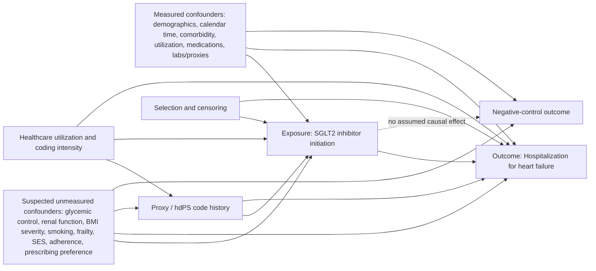

# DAG

```mermaid
flowchart LR
  U["Suspected unmeasured confounders: glycemic control, renal function, BMI severity, smoking, frailty, SES, adherence, prescribing preference"] --> A["Exposure: SGLT2 inhibitor initiation"]
  U --> Y["Outcome: Hospitalization for heart failure"]
  L["Measured confounders: demographics, calendar time, comorbidity, utilization, medications, labs/proxies"] --> A
  L --> Y
  P["Proxy / hdPS code history"] --> A
  P --> Y
  U --> P
  HCU["Healthcare utilization and coding intensity"] --> P
  HCU --> A
  HCU --> Y
  S["Selection and censoring"] --> A
  S --> Y
  A --> Y
  A -. no assumed causal effect .-> NCO["Negative-control outcome"]
  U --> NCO
  L --> NCO
```

This DAG is a working identification aid, not proof of identifiability.
